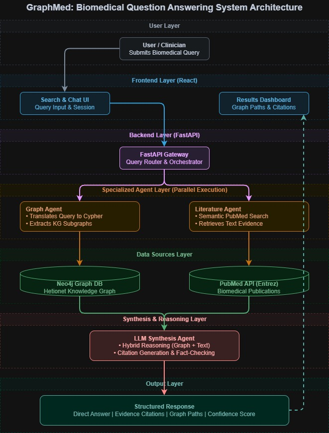

# 🧬 GraphMed — Biomedical Research Assistant

## AI-Powered Knowledge Graph & Literature Search Engine

An intelligent biomedical research assistant that integrates structured knowledge graph data (Hetionet/Neo4j) with PubMed literature search to provide evidence-based, comprehensive answers to complex biomedical queries involving drugs, diseases, genes, pathways, and their relationships.



---

# 📋 Table of Contents

- [Project Overview](#-project-overview)
- [Key Features](#-key-features)
- [Technology Stack](#-technology-stack)
- [System Architecture](#-system-architecture)
- [Complete Workflow](#-complete-workflow)
- [Data Sources](#-data-sources)
- [Project Structure](#-project-structure)
- [Setup & Installation](#-setup--installation)
- [Usage](#-usage)
- [API Reference](#-api-reference)
- [Logging](#-logging)
- [Error Handling](#-error-handling)
- [Testing](#-testing)
- [Contributing](#-contributing)
- [License](#-license)
- [Contact](#-contact)

---

# 🎯 Project Overview

GraphMed enables researchers and healthcare professionals to query biomedical relationships using natural language. The system uses a single LLM agent (Google Gemini) with a dual-tool architecture that autonomously:

1. **Generates and executes Cypher queries** against the Hetionet knowledge graph (47,031 nodes, 2.25M relationships)
2. **Extracts biomedical search terms** and queries PubMed for supporting literature
3. **Synthesizes both sources** into clinically responsible, evidence-based answers

The assistant is designed to be transparent about its data sources, clearly distinguishing between knowledge graph associations and peer-reviewed literature findings.

---

# ✨ Key Features

| Feature | Description |
|---------|-------------|
| **Natural Language Querying** | Ask biomedical questions in plain English |
| **Automated Cypher Generation** | LLM generates valid Neo4j queries with self-correction |
| **PubMed Integration** | Searches NCBI for supporting research articles |
| **Evidence Synthesis** | Combines graph data with literature into comprehensive answers |
| **Anti-Hallucination** | Strict rules ensure only tool-returned data is reported |
| **Professional Formatting** | Responses follow clinical documentation standards |
| **Self-Correcting Queries** | Agent retries with corrected syntax on failure |
| **Request Logging** | Every request, DB response, and LLM output is logged |

---

# 🛠 Technology Stack

| Layer | Technology | Purpose |
|-------|-----------|---------|
| Frontend | React, Vite, Tailwind CSS | Chat interface |
| API Client | Axios | HTTP requests to backend |
| Backend | Python, FastAPI, Uvicorn | REST API server |
| LLM Framework | Pydantic AI | Agent orchestration with tools |
| LLM Model | Google Gemini 2.5 Flash Lite | Query generation + synthesis |
| Database | Neo4j (Hetionet v1.0) | Biomedical knowledge graph |
| External API | NCBI PubMed E-utilities | Research literature search |
| Logging | Python logging (file-based) | Request/response tracking |
| Testing | Pytest | Integration tests |

---
## System Architecture 


## Sequence Diagram


---

# 🔄 Complete Workflow

## Step 1: User Input

User types a biomedical question in the chat interface.

```text
What are the side effects of metformin?
```

## Step 2: API Request

Frontend sends an HTTP POST request to the backend.

```http
POST http://localhost:8000/query/ask
Content-Type: application/json

{
  "question": "What are the side effects of metformin?"
}
```

## Step 3: Request Validation

FastAPI validates the request.

- Missing question field → **422 Unprocessable Entity**
- Missing API key → **500 LLM service not configured**

## Step 4: Agent Invocation

The LLM agent receives the question together with a system prompt containing:

- Full database schema (node labels, relationships, properties)
- Cypher syntax rules with examples
- PubMed query extraction guidelines
- Anti-hallucination rules

## Step 5: Tool 1 — Knowledge Graph Query

The LLM generates and executes a Cypher query.

```cypher
MATCH (c:Compound)-[:causes]->(se:`Side Effect`)
WHERE toLower(c.name) CONTAINS 'metformin'
RETURN se.name
LIMIT 25
```

If the query fails due to syntax errors, the agent automatically corrects it and retries.

## Step 6: Tool 2 — PubMed Search

The LLM extracts biomedical search terms.

```text
Extracted terms:
- metformin
- side effects
- adverse events
```

PubMed returns:

- Article titles
- Authors
- Journals
- Publication dates
- PMIDs

## Step 7: Answer Synthesis

The LLM combines both sources while following strict rules:

- Reports exact result counts
- Clearly attributes findings to the Knowledge Graph or PubMed
- Never invents information
- Uses clinical documentation formatting

## Step 8: Response Delivery

```json
{
  "question": "What are the side effects of metformin?",
  "answer": "Based on the Hetionet knowledge graph, metformin is associated with 25 reported side effects..."
}
```

# 📊 Data Sources

## Hetionet Knowledge Graph

| Node Label | Count | Description |
|------------|------:|-------------|
| Gene | 20,945 | Human genes |
| Biological Process | 11,381 | GO biological processes |
| Side Effect | 5,734 | Drug side effects |
| Molecular Function | 2,884 | GO molecular functions |
| Pathway | 1,822 | Biological pathways |
| Compound | 1,552 | Drugs and compounds |
| Cellular Component | 1,391 | GO cellular components |
| Symptom | 438 | Disease symptoms |
| Anatomy | 402 | Anatomical structures |
| Pharmacologic Class | 345 | Drug classes |
| Disease | 137 | Diseases |

**Total:** **47,031 Nodes** • **2,250,197 Relationships**

---

## Relationship Types

| Relationship | Example |
|--------------|---------|
| binds | Metformin → binds → NDUFA10 |
| treats | Metformin → treats → Diabetes |
| causes | Metformin → causes → Diarrhea |
| associates | Alzheimer's → associates → APOE |
| localizes | Alzheimer's → localizes → Forebrain |
| presents | Alzheimer's → presents → Memory loss |
| interacts | BRCA1 → interacts → BRCA2 |
| participates | TP53 → participates → Apoptosis |
| expresses | Liver → expresses → CYP3A4 |
| upregulates | Metformin → upregulates → Gene |
| downregulates | Metformin → downregulates → Gene |
| palliates | Drug → palliates → Disease |
| resembles | Disease A → resembles → Disease B |
| includes | Drug Class → includes → Compound |

---

## PubMed (NCBI E-utilities)

- Real-time search across **35M+ biomedical articles**
- Returns:
  - Title
  - Authors
  - Journal
  - Publication Date
  - PMID
- Used for literature-backed evidence support

---

# 📁 Project Structure

```text
GRAPHMED/
├── backend/
│   ├── app/
│   │   ├── agents/
│   │   │   ├── __init__.py
│   │   │   └── agent.py
│   │   ├── helpers/
│   │   │   ├── __init__.py
│   │   │   ├── neo4j_helper.py
│   │   │   └── pubmed_api.py
│   │   ├── routes/
│   │   │   ├── __init__.py
│   │   │   ├── nodes.py
│   │   │   └── query.py
│   │   ├── __init__.py
│   │   ├── database.py
│   │   ├── logger.py
│   │   └── main.py
│   │
│   ├── logs/
│   │   └── graphmed_YYYY-MM-DD.log
│   │
│   ├── tests/
│   │   ├── conftest.py
│   │   ├── test_health.py
│   │   └── test_query.py
│   │
│   ├── .env
│   └── requirements.txt
│
├── frontend/
│   ├── src/
│   │   ├── api/
│   │   │   └── index.js
│   │   ├── components/
│   │   │   ├── ChatWindow.jsx
│   │   │   ├── ChatInput.jsx
│   │   │   └── MessageBubble.jsx
│   │   ├── App.jsx
│   │   ├── main.jsx
│   │   └── index.css
│   │
│   ├── index.html
│   ├── vite.config.js
│   └── package.json
│
├── .gitignore
├── Graphmed_arch.jpg
└── README.md
```

---

# 🚀 Setup & Installation

## Prerequisites

| Requirement | Version |
|-------------|----------|
| Python | 3.10+ |
| Node.js | 18+ |
| Neo4j Desktop | Latest |
| Google API Key | Gemini Access |

---

## 1. Clone Repository

```bash
git clone https://github.com/your-username/GraphMed.git
cd GraphMed
```

---

## 2. Backend Setup

```bash
cd backend

# Create virtual environment
python -m venv venv
```

### Windows

```bash
venv\Scripts\activate
```

### macOS / Linux

```bash
source venv/bin/activate
```

Install dependencies.

```bash
pip install -r requirements.txt
```

---

## 3. Configure Environment

Create `backend/.env`

```env
NEO4J_URI=bolt://127.0.0.1:7687
NEO4J_USERNAME=neo4j
NEO4J_PASSWORD=your_neo4j_password
GOOGLE_API_KEY=your_google_api_key
```

---

## 4. Load Hetionet Database

1. Open Neo4j Desktop
2. Create a new project
3. Create a new database
4. Import the Hetionet dataset
5. Start the database
6. Verify the Bolt connection:

```text
bolt://127.0.0.1:7687
```

---

## 5. Start Backend

```bash
cd backend

python -m uvicorn app.main:app \
    --host 0.0.0.0 \
    --port 8000 \
    --reload
```

Expected output

```text
INFO:     Uvicorn running on http://0.0.0.0:8000

✅ Connected to Neo4j

INFO:     Application startup complete.
```

---

## 6. Frontend Setup

```bash
cd frontend

npm install

npm run dev
```

---

## 7. Access the Application

| Service | URL |
|---------|-----|
| Frontend | http://localhost:5173 |
| Backend API | http://localhost:8000 |
| Swagger Docs | http://localhost:8000/docs |

> **Windows Users:** Use **http://localhost:8000** instead of **http://0.0.0.0:8000**

---

# 💡 Usage

## Example Questions

| Question | What It Queries |
|-----------|-----------------|
| What genes does Metformin bind to? | Compound → binds → Gene |
| What are the side effects of aspirin? | Compound → causes → Side Effect |
| What genes are associated with Alzheimer's? | Disease → associates → Gene |
| What drugs treat Type 2 Diabetes? | Compound → treats → Disease |
| What pathways does TP53 participate in? | Gene → participates → Pathway |
| What anatomies does Parkinson's localize to? | Disease → localizes → Anatomy |
| How is BRCA1 related to breast cancer? | Multi-hop query + PubMed |

---

## Sample Interaction

**User**

```text
What are the side effects of metformin?
```

**GraphMed Response**

```text
Metformin is most commonly associated with gastrointestinal adverse effects.

Knowledge Graph (Hetionet) — 25 side effects found

Common side effects:
• Diarrhea
• Nausea
• Abdominal discomfort
• Reduced appetite

Less common:
• Vitamin B12 deficiency
• Metallic taste
• Flatulence

Rare but serious:
• Lactic acidosis

Supporting Literature (PubMed)

• "Metformin: A Review of Its Safety and Efficacy"
• "Gastrointestinal Effects of Metformin"

Note:
These results reflect associations from the Hetionet knowledge graph
and PubMed literature. Verify against authoritative clinical sources.
```

---

# 📡 API Reference

## POST `/query/ask`

Ask a natural-language biomedical question.

### Request

```bash
curl -X POST http://localhost:8000/query/ask \
  -H "Content-Type: application/json" \
  -d '{"question":"What genes are associated with Alzheimer disease?"}'
```

### Response

```json
{
  "question": "What genes are associated with Alzheimer disease?",
  "answer": "Based on the Hetionet knowledge graph, 25 genes are associated with Alzheimer's disease including APOE, APP, BACE1, BACE2, PSEN1..."
}
```

### Error Responses

| Code | Body | Cause |
|------|------|-------|
| 422 | `{"detail":[...]}` | Invalid request body |
| 500 | `{"detail":"LLM service not configured"}` | GOOGLE_API_KEY missing |
| 500 | `{"detail":"Failed to process question..."}` | Agent execution error |

---

## GET `/nodes/search`

Search nodes in the knowledge graph.

### Request

```bash
curl "http://localhost:8000/nodes/search?name=metformin&kind=compound&limit=25"
```

### Response

```json
{
  "count": 1,
  "nodes": [
    {
      "name": "Metformin",
      "kind": "Compound"
    }
  ]
}
```

### Parameters

| Name | Type | Required | Description |
|------|------|----------|-------------|
| name | string | Yes | Node name to search |
| kind | string | No | Label filter |
| limit | integer | No | Maximum results (Default: 25) |

---

## GET `/`

Health check endpoint.

```json
{
  "status": "running",
  "service": "GraphMed API"
}
```

# 📝 Logging

## Log Location

```text
backend/logs/graphmed_YYYY-MM-DD.log
```

A new log file is created daily. Log files are ignored by Git (`.gitignore`) and are never pushed to the repository.

---

## What Gets Logged

| Stage | Prefix | Content |
|-------|--------|---------|
| User Request | REQUEST | Full question text |
| Cypher Generation | TOOL:NEO4J | Generated Cypher query |
| Database Response | TOOL:NEO4J | Result count + sample results |
| PubMed Search | TOOL:PUBMED | Search terms used |
| PubMed Response | TOOL:PUBMED | Article count + sample articles |
| Final Answer | FINAL ANSWER | Generated response |
| Errors | ERROR | Complete error message |

---

## Sample Log

```text
2026-07-02 10:00:43 | INFO | ================================================================================
2026-07-02 10:00:43 | INFO | REQUEST | User Question: What are the side effects of metformin
2026-07-02 10:00:43 | INFO | ================================================================================

2026-07-02 10:00:48 | INFO | TOOL:NEO4J | Cypher:
MATCH (c:Compound)-[:causes]->(se:`Side Effect`)
WHERE toLower(c.name) CONTAINS 'metformin'
RETURN se.name
LIMIT 25

2026-07-02 10:00:48 | INFO | TOOL:NEO4J | Result Count: 25
2026-07-02 10:00:48 | INFO | TOOL:NEO4J | Sample:
[
  {"se.name":"Diarrhea"},
  {"se.name":"Nausea"}
]

2026-07-02 10:00:51 | INFO | TOOL:PUBMED | Search Terms:
['metformin', 'side effects', 'adverse events']

2026-07-02 10:00:53 | INFO | TOOL:PUBMED | Article Count: 5

2026-07-02 10:00:58 | INFO | FINAL ANSWER |
Metformin is most commonly associated with gastrointestinal adverse effects...

2026-07-02 10:00:58 | INFO | ================================================================================
```

---

# ⚠️ Error Handling

| Error Type | Strategy | User Impact |
|------------|----------|-------------|
| Invalid request body | 422 Pydantic validation | Clear validation error |
| Missing API key | Return HTTP 500 | "LLM service not configured" |
| Invalid Cypher syntax | Agent retries automatically | Transparent self-correction |
| Neo4j connection failure | Exception logged | Query failure message |
| PubMed API timeout | Exception logged | Literature search failure |
| LLM returns invalid output | Fallback handling | Graceful error response |
| Rate limiting | Error logged and returned | Processing failure |
| Frontend network error | Axios catch block | Connection error message |

---

# 🧪 Testing

## Run Tests

```bash
cd backend

pytest tests/ -v
```

---

## Test Coverage

| Test File | Purpose |
|-----------|---------|
| `test_health.py` | Verifies server startup and health endpoint |
| `test_query.py` | Validates `/query/ask` response structure |

---

## Manual Testing

Use the interactive Swagger documentation.

```text
http://localhost:8000/docs
```

You can test every API endpoint directly from the browser.

---

# 🤝 Contributing

## How to Contribute

### 1. Fork the Repository

Fork the project to your GitHub account.

---

### 2. Create a Feature Branch

```bash
git checkout -b feature/your-feature-name
```

---

### 3. Commit Your Changes

```bash
git commit -m "feat: add your feature description"
```

---

### 4. Push to GitHub

```bash
git push origin feature/your-feature-name
```

---

### 5. Open a Pull Request

Submit a Pull Request describing:

- What was changed
- Why it was changed
- Screenshots (if applicable)
- Related issues

---

## Contribution Guidelines

- Follow the existing project structure.
- Keep code readable and documented.
- Write tests for new features.
- Update the README if APIs change.
- Follow Conventional Commits.
- Never commit `.env` files.
- Never commit log files.

---

## Areas for Contribution

- Additional biomedical datasets
- Improved Cypher generation
- Better response formatting
- Graph visualization
- Multi-turn conversations
- Performance optimization
- Caching
- Authentication
- Docker deployment

---

# 📄 License

This project uses the **Hetionet** dataset, which is distributed under the **CC0 1.0 Universal License**.

Please ensure compliance with the licenses of any additional datasets or APIs integrated into the project.

---

# 📬 Contact

| Role | Name | ID |
|------|------|----|
| Developer | - | kljw429 |
| Reviewer | - | kqgw600 |

---

# 🔧 Environment Variables

| Variable | Description | Example |
|----------|-------------|---------|
| `NEO4J_URI` | Neo4j Bolt connection URI | `bolt://127.0.0.1:7687` |
| `NEO4J_USERNAME` | Neo4j username | `neo4j` |
| `NEO4J_PASSWORD` | Neo4j password | `your_password` |
| `GOOGLE_API_KEY` | Google Gemini API Key | `AIza...` |

---

# 📌 Notes

- **Windows Users:** Always use `http://localhost:8000` instead of `http://0.0.0.0:8000`.
- Ensure the Hetionet database is running before starting the backend.
- Obtain a valid Google Gemini API key from **Google AI Studio**.
- Log files are stored under `backend/logs/` and should never be committed to Git.

---

## ⭐ Future Enhancements

- Multi-agent architecture
- Graph visualization using Neo4j Bloom
- RAG-based document retrieval
- Clinical trial integration
- Drug interaction analysis
- Authentication & user accounts
- Conversation history
- Docker & Kubernetes deployment
- CI/CD using GitHub Actions
- Cloud deployment (Azure / AWS / GCP)

---

## 🙌 Acknowledgements

- **Hetionet** for providing the biomedical knowledge graph.
- **NCBI PubMed** for literature search APIs.
- **Google Gemini** for LLM capabilities.
- **Neo4j** for graph database technology.
- **FastAPI**, **React**, and **Pydantic AI** for powering the application.

---

<div align="center">

**GraphMed — Bridging Biomedical Knowledge Graphs with Scientific Literature**

Made with ❤️ using **React**, **FastAPI**, **Neo4j**, **Google Gemini**, and **Pydantic AI**

</div>
